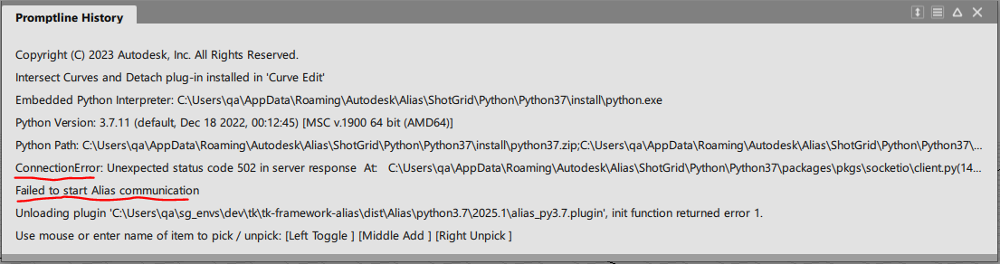

Troubleshooting
~~~~~~~~~~~~~~~~

Alias does not launch from FPT Desktop
=============================================

1. Check the FPT Desktop Engine log for error messages. The log file should be found at ``%APPDATA%\Shotgun\Logs\tk-desktop.log``

2. Check that this folder exists ``%APPDATA%\Autodesk\Alias\ShotGrid``.

Flow Production Menu does not appear in Alias
=============================================

In this case, Alias has launched successfully from FPT Desktop but the Flow Production Menu does not appear.

1. Check the Alias Promptline History for error messages. If successful, you will see the following messages:

.. code-block:: console

    Embedded Python Interpreter: C:\Users\qa\AppData\Roaming\Autodesk\Alias\ShotGrid\Python\Python37\install\python.exe
    Python Version: 3.7.11 (default, Dec 18 2022, 00:12:45) [MSC v.1900 64 bit (AMD64)]
    Python Path: C:\Users\qa\AppData\Roaming\Autodesk\Alias\ShotGrid\Python\Python37\install\python37.zip;C:\Users\qa\AppData\Roaming\Autodesk\Alias\ShotGrid\Python\Python37\install;<path_to_tk-framework-alias>\python
    Running Alias Python API server
    Starting client 'flow-production-tracking'...
    Flow Production Tracking initialized

2. Check the FPT Alias Engine log for error messages. The log file should be found at ``%APPDATA%\Shotgun\Logs\tk-alias.log``. If there is no tk-alias.log file, that means the FPT Alias Plugin may have loaded, but it then failed to start the FPT Alias Engine.

3. Check the FPT Alias plugin logs for error message. These logs are found in the folder ``%APPDATA%\Autodesk\Alias\ShotGrid\plugin\logs``. There are three logs:
* wsgi.log
* sio_server.log
* sio_client.log

If the FPT Alias communication has started up successfully, you should see in the ``wsgi.log``:

.. code-block:: console

    (9328) wsgi starting up on http://127.0.0.1:8000
    (9328) accepted ('127.0.0.1', 63313)
    127.0.0.1 - - [11/Dec/2024 09:26:47] "GET /socket.io/?transport=polling&EIO=4&t=1733927207.5092578 HTTP/1.1" 200 279 0.000000

* Line 1: This indicates the WSGI web server has started up and listening on host 127.0.0.1 on port 8000. The ID of the process running the server is 9328. 
* Line 2: The server has received and accepted a new client connection. The client sent the connection from PID 63313.
* Line 3: The client made a GET request to the server, and the server reported a successful 200 response.

If only Line 1 is logged, then the server has started but has not received any connections. Check that your firewall settings allow incoming connections and traffic to the host and port number.

4. Test if a simple HTTP client can connect to the server:

a. Launch Alias

b. Check the AppData/Roaming/Autodesk/Alias/ShotGrid/plugin/logs/wsgi.log file to see this gets logs:

.. code-block:: console

    (3692) wsgi starting up on http://127.0.0.1:8000/

c. Then open a python interpreter and run:

.. code-block:: python

    # May need to run python -m pip install requests
    import requests

    # Manually send a request to check if the server is running and can receive a new connection
    response = requests.get("http://127.0.0.1:8000/socket.io/?transport=polling&EIO=4")
    print(response)

    # Should see output <Response [200]> if server is started successfully and receiving connections

Note that if the port is different, you will need to replace ``8000`` with the port that is in the log message

.. _proxy_server_troubleshooting:

Proxy Server Troubleshooting
------------------------------

If you are running Flow Production Tracking with a proxy server, you may encounter issues with Alias. To troubleshoot:

1. Turn on "Advanced > Toggle Debug Logging" from Flow Production Tracking Desktop

2. Launch Alias from Flow Production Tracking Desktop

3. If you do not see a Python console window pop up after launching Alias, your proxy server may be causing Flow Production Tracking to fail.

4. Check the Alias prompt line for error messages, if you see this error, your proxy server may be causing Flow Production Tracking to fail.

\

**Possible solutions:**

1. Before launching Flow Production Tracking Desktop, set the environment variable :ref:`env_var_sgtk_enforce_proxy_localhost` to ``1``. This will force Flow Production Tracking Desktop to use the proxy settings from the environment variables:

.. code-block:: console

    set SGTK_ENFORCE_PROXY_LOCALHOST=1
    "C:\Program Files\Shotgun\Shotgun.exe"

2. If you can allow the Alias/FPT communication on localhost ``127.0.0.1`` to bypass your proxy server (e.g. communication over localhost will not run through your proxy server), add ``127.0.0.1`` to your proxy server exception settings.

**If you are experiencing any of these issues, please contact support.**
