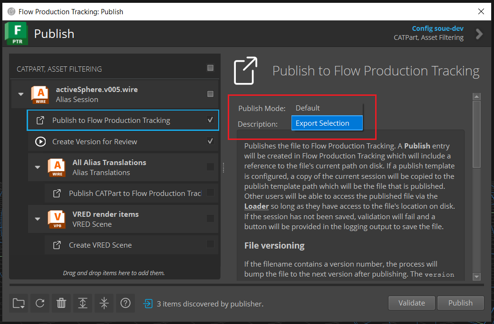

v4.1.1
=====================

Release highlights
------------------

* New publish mode "Export Selection"
* New publish option to choose publish mode

New Features
-------------

The Alias publish plugin "Publish to Flow Production Tracking" has a new Publish Mode option:

\

The "Default" publish mode will publish the working file as is, as it did before introducing the Publish Mode option, there is no change in behavior.

The "Export Selection" publish mode will publish only the selected objects in the Alias scene.

.. note::

    The working file will not be changed. This means that the published file will differ from the corresponding working file version.

.. warning::

    The "Export Selection" publish mode is not supported with Background Publishing. You must turn off the ``Background Processing`` setting in your configuration to use this publish mode. Refer to this `documentation <https://developers.shotgridsoftware.com/tk-multi-bg-publish/add_to_config.html#adding-this-app-to-your-config>`_ on how to turn off this setting.

By default, the "Default" publish mode is selected. To change the default publish mode, you can modify your configuration file ``tk-multi-publish2.yml``, for example:

.. code-block:: yaml

    settings.tk-multi-publish2.alias.asset_step:
        publish_plugins:
        - name: Publish to Flow Production Tracking
            hook: "{self}/publish_file.py:{engine}/tk-multi-publish2/basic/publish_session.py"
            settings:
            Publish Template: alias_asset_publish
            Publish Mode: Export Selection
