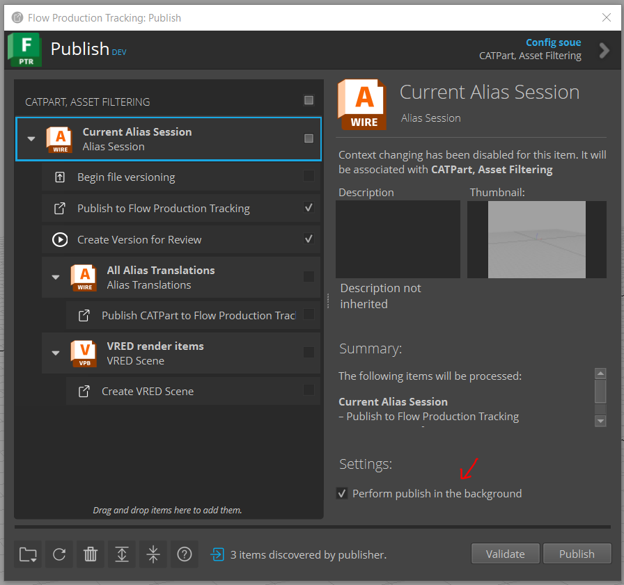

v4.1.5
=====================

Release highlights
------------------

* Background Publishing can be toggled on/off from Publish2 App UI
* Improve performance when performing multiple actions at once from Loader2 App
* Bug fix to correctly handle proxy servers

Dependencies
---------------

* Publish2 App: ``tk-multi-publish2 v2.10.3``

    * Includes update for the new publish setting option to turn on/off publishing in the background

    * Required to use Background Publishing with tk-alias ``v4.1.5`` or later

    * Configuration must be updated to use Publish2 App ``v2.10.3`` or later

* Alias Framework: ``tk-framework-alias v2.2.0``

    * Required to fix proxy server handling

    * Framework is automatically updated by the engine `info.yml`

New Features
-------------

**Background Publishing Setting**

A new publish setting option has been added to the Publish2 App to turn on/off publishing in the background. This requires tk-multi-publish2 ``v2.10.3`` or later.

To use the new publish setting:

1. Open the Publish2 App
2. Click on the root publish item *Current Alias Session*
3. Check the Settings option *Perform publish in the background* to run the publish in the background (or uncheck to run normally)

\

.. note::

    This new setting in the Publish App has replaced the ``Background Processing`` configuration setting. This setting does not need to be added to perform background publishing, the setting in the Publish2 App will handle this. You may still set the configuration setting to set the default value of the checkbox option in the Publish App.

    .. image:: images/publish-bg-config-setting.png
        :alt: Background Publish Setting
        :width: 800px
        :align: center

    \

Bug Fixes
-------------

* FPTR integration can be run with Alias using a proxy server. If you are using a proxy server and are still experiencing issues, see :ref:`proxy_server_troubleshooting` for more information.
